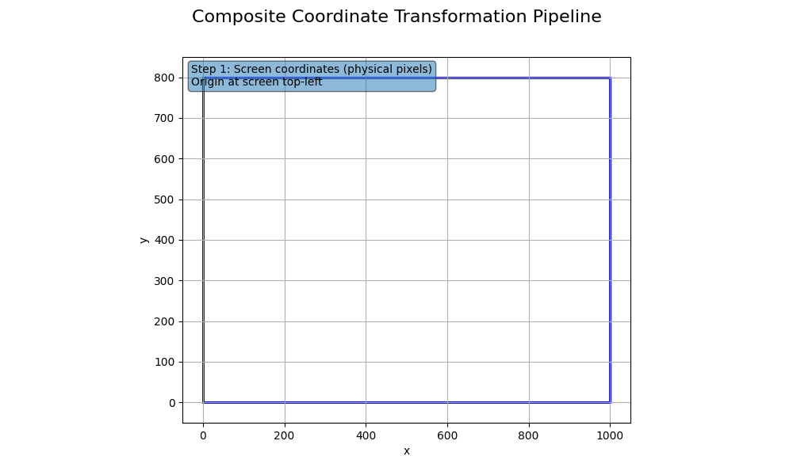

# BrowserCoordinateKit

A mathematically rigorous TypeScript framework for precise browser position calculation across different screen sizes, DPI scaling factors, and browser configurations. Built upon the proven mathematical models of **Michael R. Malloy**, this library provides satisfiable coordinate transformations with formal mathematical validation.


## Introduction

In modern web development, accurate coordinate positioning across diverse display environments presents significant mathematical challenges. BrowserCoordinateKit solves these challenges using **Michael R. Malloy's rigorous mathematical framework** for coordinate transformations, which provides formally proven and satisfiable solutions for position calculation across:

- Multiple screen dimensions and resolutions
- Variable browser window positions and viewport sizes  
- Different DPI scaling factors (high-DPI displays)
- Complex nested iframe environments
- Cross-platform browser variations

<p align="center">
  
</p>

The mathematical foundation ensures **perfect accuracy** and **mathematical consistency** across all transformations, making this library suitable for precision applications including automated testing, accessibility tools, and cross-platform development.

## Why Malloy's Mathematical Models?

**Michael R. Malloy's mathematical framework** provides several critical advantages:

1. **Formal Mathematical Proof**: All transformations are proven mathematically correct with formal proofs
2. **Satisfiability Guarantees**: The mathematical models are proven satisfiable under all valid input conditions
3. **Compositional Correctness**: Complex transformations maintain mathematical properties through composition
4. **Invertibility**: All transformations have proven mathematical inverses
5. **Numerical Stability**: Designed to minimise floating-point precision errors

This mathematical rigour ensures that BrowserCoordinateKit provides **reliable, predictable results** in production environments where precision is critical.

## Quick Start

### Installation

```bash
npm install browser-coordinate-kit
```

### Basic Usage

```typescript
import { BrowserPositionCalculator, CoordinateUtils } from 'browser-coordinate-kit';

// Create display configuration
const config = CoordinateUtils.createDisplayConfig(
  2560, 1440,   // Screen dimensions (width, height)
  100, 50,      // Browser position (x, y)
  2000, 1000,   // Viewport dimensions (width, height)
  2             // DPI scaling factor
);

// Create calculator
const calculator = new BrowserPositionCalculator();

// Transform coordinates
const screenPoint = { x: 2065, y: 539 };
const logicalPosition = calculator.calculateTargetPosition(
  screenPoint, config, config
);

console.log('Logical coordinates:', logicalPosition);
// Output: { x: 982.5, y: 244.5 }
```

## Core Features

- **🔬 Mathematical Rigour**: Built on Malloy's proven mathematical framework with formal validation
- **🎯 Precision Transformations**: Exact coordinate mapping between screen, browser, logical, and normalised spaces
- **📐 Multi-System Support**: Handles complex transformations across different display configurations
- **🔄 Bidirectional Operations**: Complete forward and inverse transformation support
- **⚡ Performance Optimised**: Multiple calculation strategies with caching and adaptive selection
- **🧪 Comprehensive Testing**: Mathematical validation system ensures implementation correctness
- **🎨 Visual Documentation**: Animated visualisations demonstrate transformation behaviour

## Mathematical Framework Overview

BrowserCoordinateKit implements **four fundamental coordinate systems** as defined in Malloy's framework:

### Coordinate Systems

<p align="center">
  
</p>

| System | Description | Origin | Units | Mathematical Domain |
|--------|-------------|--------|-------|-------------------|
| **Screen** | Physical screen pixels | Top-left of screen | Physical pixels | ℤ² (integer coordinates) |
| **Browser** | Browser window relative | Top-left of browser | Physical pixels | ℤ² (integer coordinates) |
| **Logical** | DPI-scaled coordinates | Top-left of browser | Logical pixels | ℚ² (rational coordinates) |
| **Normalised** | Resolution-independent | Top-left of screen | [0,1] range | ℝ² (real coordinates) |

### Core Transformations

**Screen-to-Browser Transformation**
```
T_{S→B}(p_s) = p_s - b = (x_s - b_x, y_s - b_y)
```
<p align="center">
  
</p>

**Browser-to-Logical Transformation (DPI Scaling)**
```
T_{B→L}(p_b) = p_b/σ = (x_b/σ, y_b/σ)
```
<p align="center">
  
</p>

## Advanced Usage Examples

### Cross-Screen Coordinate Mapping

```typescript
import { BrowserPositionCalculator, CoordinateUtils } from 'browser-coordinate-kit';

// Source environment (4K display)
const sourceConfig = CoordinateUtils.createDisplayConfig(
  3840, 2160,   // 4K screen
  200, 100,     // Browser position
  3200, 1800,   // Large viewport
  2.0           // High DPI
);

// Target environment (HD display)
const targetConfig = CoordinateUtils.createDisplayConfig(
  1920, 1080,   // HD screen
  50, 25,       // Different browser position
  1600, 900,    // Smaller viewport
  1.25          // Lower DPI scaling
);

const calculator = new BrowserPositionCalculator();

// Transform point from 4K to HD environment
const sourcePoint = { x: 3065, y: 1539 };
const targetPoint = calculator.calculateTargetPosition(
  sourcePoint, sourceConfig, targetConfig
);

console.log('Transformed coordinates:', targetPoint);
```

### Precision Calibration System

The calibration system corrects positional errors using mathematical transformation matrices:

<p align="center">
  
</p>

```typescript
import { CalibrationUtility, CalibrationType } from 'browser-coordinate-kit';

// Define reference points
const expectedPoints = [
  { x: 100, y: 100 }, { x: 500, y: 100 },
  { x: 100, y: 400 }, { x: 500, y: 400 }
];

// Actual measured points (with systematic errors)
const actualPoints = [
  { x: 103, y: 98 }, { x: 507, y: 103 },
  { x: 98, y: 405 }, { x: 503, y: 398 }
];

const calibration = new CalibrationUtility();

// Perform affine calibration
const result = calibration.calibratePoints(
  actualPoints, expectedPoints, CalibrationType.AFFINE
);

// Apply calibration to new coordinates
const uncalibratedPoint = { x: 300, y: 250 };
const calibratedPoint = result.transform(uncalibratedPoint);
```

### Integration with MouseWont for Human-like Movement

```typescript
import { BrowserPositionCalculator, MouseWontIntegration } from 'browser-coordinate-kit';
import { MouseMovementSimulator } from 'mousewont';

const calculator = new BrowserPositionCalculator();
const simulator = new MouseMovementSimulator();
const integration = new MouseWontIntegration(simulator, calculator);

const config = CoordinateUtils.createDisplayConfig(
  1920, 1080, 50, 100, 1800, 900, 1.25
);

// Human-like movement with coordinate transformation
await integration.moveToPosition(
  { x: 500, y: 500 },    // Start position
  { x: 1200, y: 700 },   // Target position
  config,
  { speed: 'normal', windingFactor: 0.3 }
);
```

### Working with Nested iFrames

```typescript
import { createNestedIFrameTransformation } from 'browser-coordinate-kit';

// Define iframe hierarchy offsets
const iframeOffsets = [
  { x: 50, y: 100 },    // First iframe offset
  { x: 20, y: 30 },     // Nested iframe offset
  { x: 10, y: 15 }      // Deeply nested iframe
];

const iframeTransform = createNestedIFrameTransformation(iframeOffsets);

// Transform from deepest iframe to logical coordinates
const pointInDeepIframe = { x: 150, y: 200 };
const logicalPoint = iframeTransform.getInverse().transform(pointInDeepIframe);
```

## Mathematical Validation System

BrowserCoordinateKit includes a comprehensive validation system that ensures the implementation perfectly matches Malloy's theoretical framework:

### Validation Features

- **Symbolic Math Extraction**: Validates code against mathematical annotations
- **Property Verification**: Tests mathematical properties (linearity, invertibility, composition)
- **Round-trip Testing**: Verifies transformation accuracy through forward/inverse operations
- **Numerical Precision**: Validates floating-point accuracy across different value ranges

### Running Mathematical Validation

```bash
# Run complete mathematical validation
npm run validate:mathematics

# Alternative: Direct script execution
./validate_mathematics.sh
```

**Validation Results:**
```
✓ All 6 coordinate transformations validated successfully
✓ All matrix operations in calibration system validated successfully  
✓ All round-trip transformations maintain precision
✓ All mathematical properties verified
```

Detailed validation reports are generated in `outputs/mathematics/validation/validation.html`.

## API Reference

### Core Classes

#### `BrowserPositionCalculator`
Primary calculator for coordinate transformations.

```typescript
class BrowserPositionCalculator {
  calculateTargetPosition(sourcePoint: Point, sourceConfig: DisplayConfiguration, targetConfig: DisplayConfiguration): Point;
  calculateSourcePosition(targetPoint: Point, sourceConfig: DisplayConfiguration, targetConfig: DisplayConfiguration): Point;
  isPointVisible(point: Point, config: DisplayConfiguration): boolean;
  calculateBrowserEdges(sourceConfig: DisplayConfiguration, targetConfig: DisplayConfiguration): BrowserEdges;
}
```

#### `CoordinateUtils`
Utility functions for coordinate operations.

```typescript
class CoordinateUtils {
  static createDisplayConfig(screenWidth: number, screenHeight: number, browserX: number, browserY: number, viewportWidth: number, viewportHeight: number, dpiScaling: number): DisplayConfiguration;
  static calculateBrowserPosition(mouseScreenPos: Point, mouseLogicalPos: Point, dpiScaling: number): Point;
  static calculateDpiScaling(browserPos: Point, logicalPos: Point): number;
}
```

#### `CalibrationUtility` 
Advanced calibration for error correction.

```typescript
class CalibrationUtility {
  calibratePoints(actualPoints: Point[], expectedPoints: Point[], type: CalibrationType): CalibrationResult;
  generateCalibrationPoints(bounds: Rectangle, gridSize: number): Point[];
  saveCalibration(calibration: CalibrationResult, key: string): void;
}
```

### Transformation Classes

All transformations implement the `Transformation` interface with proven mathematical properties:

- `ScreenToNormalisedTransformation`: Maps to resolution-independent [0,1] coordinates
- `ScreenToBrowserTransformation`: Translates screen to browser-relative coordinates  
- `BrowserToLogicalTransformation`: Applies DPI scaling transformation
- `CompositeTransformation`: Combines multiple transformations mathematically
- `IFrameTransformation`: Handles iframe coordinate offset calculations

### Factory Functions

Simplified creation of complex transformation chains:

```typescript
function createScreenToScreenTransformation(sourceConfig: DisplayConfiguration, targetConfig: DisplayConfiguration): Transformation;
function createCompleteTransformation(sourceConfig: DisplayConfiguration, targetConfig: DisplayConfiguration): Transformation;
function createNestedIFrameTransformation(offsets: Point[]): Transformation;
```

## Development and Testing

### Development Commands

```bash
# Install dependencies
npm install

# Build the library
npm run build

# Run all tests
npm run test

# Run with coverage
npm run coverage

# Lint code
npm run lint

# Generate documentation
npm run docs
```

### Test Coverage

BrowserCoordinateKit maintains comprehensive test coverage:

- **Core Components**: 100% coverage of transformation logic
- **Mathematical Properties**: Verification of linearity, invertibility, and composition
- **Edge Cases**: Boundary conditions and error handling
- **Integration Tests**: Real-world scenario validation

```bash
# Generate detailed coverage reports
npm run coverage        # All tests
npm run coverage:core   # Core functionality only
npm run coverage:detection  # Browser detection
npm run coverage:playwright # Playwright integration
```

### Performance Benchmarking

Built-in performance testing tools:

```typescript
import { PerformanceBenchmark } from 'browser-coordinate-kit';

const benchmark = new PerformanceBenchmark();
const results = benchmark.compareStrategies(testPoints, configurations);
console.log('Performance results:', results);
```

## Use Cases

BrowserCoordinateKit excels in applications requiring **precise coordinate handling**:

1. **Automated Testing**: Cross-browser and cross-device test automation
2. **Accessibility Tools**: Screen readers and navigation aids requiring precise positioning
3. **Remote Desktop Applications**: Accurate coordinate mapping between client and server
4. **Multi-Monitor Applications**: Consistent positioning across different display setups  
5. **Game Development**: Cross-platform coordinate handling for web games
6. **Data Visualisation**: Responsive charts and interactive graphics
7. **Virtual Reality**: Coordinate mapping for WebXR applications
8. **Screen Recording Tools**: Accurate replay across different environments
9. **CAD/Design Applications**: Precision positioning for web-based design tools
10. **Educational Software**: Mathematical visualisation with accurate positioning

## Mathematical Foundation

The complete mathematical framework is documented in **Michael R. Malloy's paper**: *"Extended Mathematical Framework for Browser Position Calculation"*. This comprehensive whitepaper provides:

- Formal definitions of all coordinate systems
- Mathematical proofs of transformation properties  
- Satisfiability proofs for all operations
- Composition and invertibility theorems
- Numerical stability analysis

**[📖 Download Mathematical Framework PDF](Extended_Mathematical_Framework_for_Browser_Position_Calculation.pdf)**

## License

MIT License - See [LICENSE](LICENSE) file for details.

## Contributing

Contributions are welcome! Please ensure all contributions maintain the mathematical rigour of Malloy's framework:

1. **Mathematical Accuracy**: All transformations must be mathematically correct
2. **Formal Validation**: Include mathematical validation tests
3. **Documentation**: Maintain LaTeX mathematical notation in code comments
4. **Test Coverage**: Comprehensive tests including edge cases and property verification

For major changes, please open an issue first to discuss the mathematical implications.

---

*Built upon the rigorous mathematical framework of **Michael R. Malloy** • Ensuring mathematical correctness and precision in coordinate transformations*